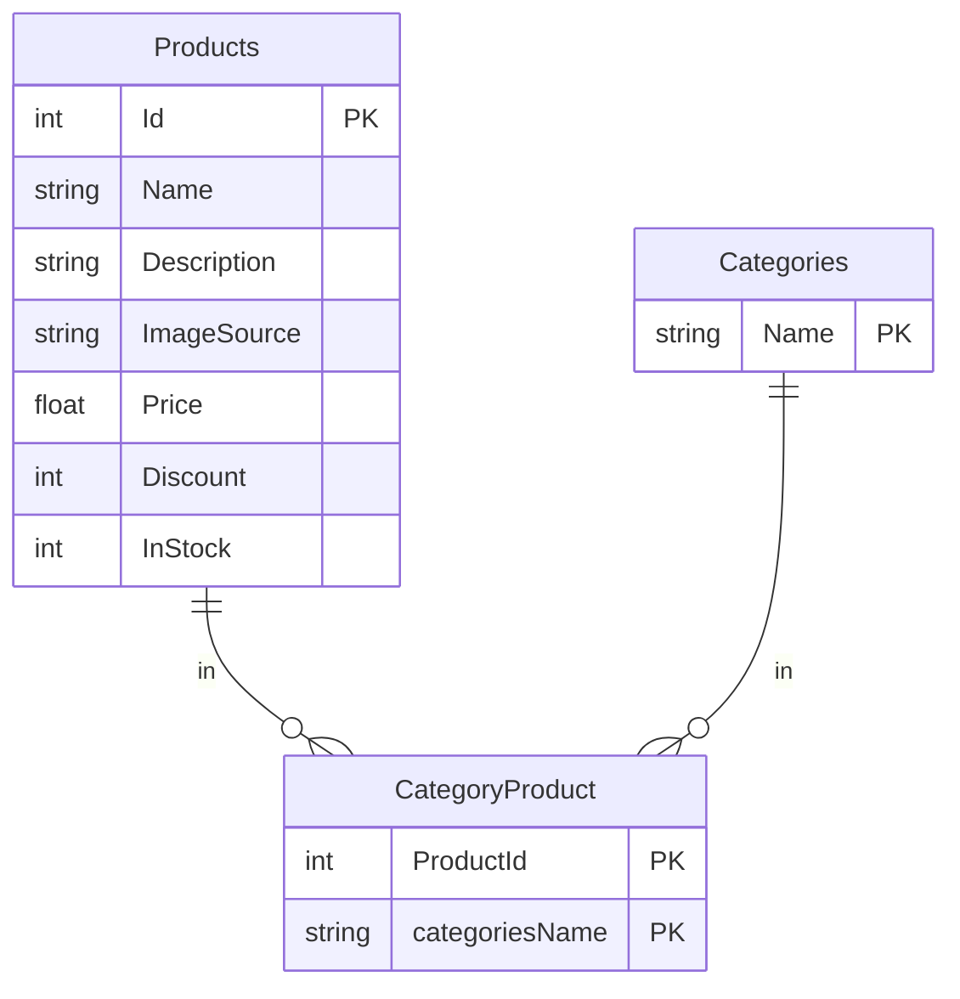

## Вопрос №2
### Часть схемы базы данных взята из моего пробного проекта [Магазин пиццы](https://github.com/MikeKondr99/PizzaStoreSln)
*для огранизации связи многие-ко-многим использовалась
промежуточная таблица `CategoryProduct`*


Скрипт для получения всех пар "Имя продукта – Имя категории"

``` sql
SELECT Name, CategoryProduct.CategoriesName
FROM Products
LEFT JOIN CategoryProduct
ON Products.Id = CategoryProduct.ProductsId;
```